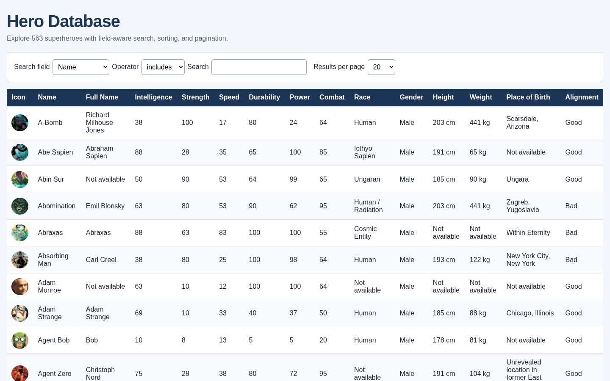

# Sortable

A framework-free browser application for exploring 563 superhero records through fast, field-aware search, stable sorting, pagination, and detailed profiles.



## Highlights

- Sorts every visible column, with numeric handling for power statistics, height, and weight
- Filters text by inclusion, exclusion, or ordered fuzzy matching
- Supports numeric equality and range comparisons
- Stores filters, sorting, page size, page, and selected hero in the URL
- Fetches the dataset once, then performs every interaction in memory
- Provides keyboard-operable headers, dialogs, focus restoration, loading feedback, and error states
- Uses native HTML, CSS, and JavaScript modules with no runtime dependencies or build step

## Run locally

The application uses browser modules and fetches its dataset remotely, so serve the repository over HTTP:

```bash
python3 -m http.server 8000
```

Then open <http://localhost:8000/>. You can also use any equivalent static-file server.

## Search

Choose a field, operator, and query from the controls above the table. Text fields support:

- `includes`
- `excludes`
- ordered fuzzy matching

Numeric fields support equality, inequality, greater-than, and less-than comparisons. Height and weight queries use centimetres and kilograms; for example, set Weight to greater than `1000`.

Selecting a hero opens the complete record without losing the current list state. Copying the URL preserves the active search, sort, pagination, and selected hero.

## Design

The application keeps a single state object and derives its visible rows in a predictable sequence:

```text
fetch once → normalize → filter → sort → paginate → render
```

Pure data modules handle normalization, filtering, sorting, pagination, and URL serialization. DOM-focused modules own the controls, table, and accessible detail dialog. This separation keeps data behavior independently testable with Node's built-in test runner.

The app reads the versioned [akabab Superhero API dataset](https://github.com/akabab/superhero-api) through a CDN endpoint. Images and character data remain subject to their respective upstream rights.

## Test

Node.js 22 or newer is recommended. No dependency installation is required.

```bash
npm test
```

The suite covers filtering operators, stable sorting, missing values, pagination, state transitions, URL restoration, hero selection, and detail-view models.

## Documentation

- [Product requirements](docs/PRD.md)
- [Architecture](docs/architecture.md)
- [Codebase guide](docs/codebase-guide.md)
- [Hardening and audit evidence](docs/issue-6-tasks.md)

## Team

Built at Zone01 Athens by `skamprogiannis`, `hmim`, and `dkolias`. Git history preserves each contributor's work and attribution.
