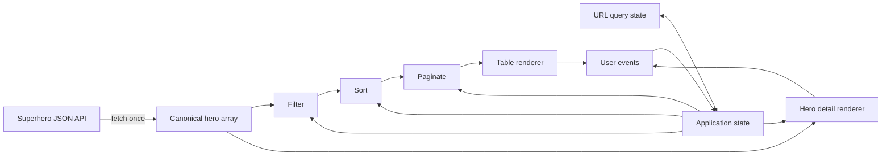

# Sortable Architecture

## Architectural Goals

- Allow the three core issues to begin in parallel.
- Fetch the dataset once and keep all interactions client-side.
- Separate data rules from DOM rendering so sorting, filtering, and pagination can be verified independently.
- Avoid shared-file ownership between the three initial workstreams wherever possible.
- Keep the application framework-free and understandable to the full team.

## System Overview

The canonical hero array is never modified. State changes recompute the visible view through one directional pipeline: filter, sort, paginate, render.

## Shared Contracts

### Application state

| Field | Meaning | Default |
|---|---|---|
| `status` | `loading`, `ready`, or `error` | `loading` |
| `heroes` | Canonical fetched records | Empty array |
| `field` | Active search field | `name` |
| `operator` | Operator valid for the field | `include` |
| `query` | Current search value | Empty string |
| `page` | One-based current page | `1` |
| `pageSize` | `10`, `20`, `50`, `100`, or `all` | `20` |
| `sortKey` | Visible column key | `name` |
| `sortDirection` | `asc` or `desc` | `asc` |
| `selectedHeroId` | Open detail record or no selection | No selection |

State is replaced through explicit actions. Feature modules receive the relevant state and return data or events; they do not mutate hidden global state.

### Column descriptors

A shared ordered descriptor list is the single source of truth for the table. Each descriptor supplies:

- A stable `key` used by sorting and URL state.
- A human-readable `label` used by the header.
- A `kind` of image, text, or number.
- A reader that extracts the raw value from a hero.
- An optional formatter for values that need custom display text.
- An optional missing-value predicate for column-specific sentinels.

The descriptor order is Icon, Name, Full Name, Intelligence, Strength, Speed, Durability, Power, Combat, Race, Gender, Height, Weight, Place of Birth, and Alignment. Icon sorting uses its source URL; Height and Weight read the metric display values that sorting normalizes for numeric comparison.

### Data functions

| Contract | Responsibility |
|---|---|
| `loadHeroes()` | Fetch and validate the official array once. |
| `filterHeroes(heroes, filterState)` | Return records matching core or advanced search. |
| `sortHeroes(heroes, sortState, columns)` | Return a sorted copy using descriptor semantics. |
| `paginateHeroes(heroes, pageState)` | Return current rows and page metadata. |
| `stateFromUrl(searchParams)` | Parse and validate restorable URL state. |
| `stateToUrl(state)` | Serialize shareable list/detail state. |

The functions return new arrays or view models and never mutate the canonical dataset or the caller's state.

## Parallel Core Workstreams

The first three Gitea issues can start at the same time because this document freezes their interfaces. They do not need to wait for another issue to merge before implementing and testing their owned modules.

| Workstream | Owner | Owns | Must not own |
|---|---|---|---|
| Application foundation and integration | `skamprog` | App shell, loading/error states, fetch, column descriptors, application state, derived pipeline, final integration | Filter, pagination, or comparator internals |
| Table, core search, and pagination | `hmim` | Table renderer, core name filter, page-size control, page navigation, empty state | Fetching, global state mutation, comparator rules |
| Sorting | `dkolias` | Sort-state transition, comparators, missing-last rules, numeric normalization, `aria-sort` output contract | Fetching, pagination, table row rendering |

Parallel development rules:

1. Each workstream develops against small deterministic hero data that follows the official API shape.
2. The table renderer accepts rows, column descriptors, sort state, and an `onSort(key)` callback; it does not sort rows itself.
3. The sorting workstream returns sorted records and next-sort state without touching the DOM.
4. The application workstream wires modules together and owns the only full-page render loop.
5. Changes to shared contracts require agreement from all three members before merge.
6. Each pull request stays within its ownership boundary; integration fixes belong to the application workstream unless the owning module is incorrect.

This makes implementation parallel, while final integration and audit verification remain deliberately serialized.

## Data Rules

### Missing values

Treat null, an empty string, `-`, `0 cm`, and `0 kg` as missing where applicable. Direction is applied only when comparing two present values; a present value always precedes a missing one. Equal present values and equal missing values use Name ascending as a stable tie-breaker.

### Numeric normalization

- Powerstats use their numeric API values.
- Height uses `.appearance.height[1]` parsed as centimetres.
- Weight uses `.appearance.weight[1]` parsed as kilograms.
- Parsing produces either a finite number or the missing-value marker; it never silently falls back to zero.

### Search

Core search performs a case-insensitive Name substring match on every input event. Bonus text filters add exclude and ordered-subsequence fuzzy matching. Numeric comparisons operate on the same normalized values used by sorting.

## Rendering and Events

- Render controls from application state so the DOM is never a second source of truth.
- Register persistent event handlers once or use deliberate event delegation.
- A heading activation dispatches only its column key; sort-state rules remain outside the renderer.
- Filtering or changing page size resets the page to 1.
- Selecting a hero looks it up in the canonical in-memory array and performs no request.
- Rendering must handle loading, error, empty, missing-value, and broken-image states.

## URL State

The query parameters are `field`, `op`, `q`, `page`, `size`, `sort`, `dir`, and `hero`. State changes use `history.replaceState` so typing does not create a history entry per keystroke. Parsing validates field names, operators, positive page numbers, page sizes, directions, and hero IDs; invalid values use defaults.

Opening details adds or replaces only `hero`. Closing details removes only `hero`, leaving the list state intact.

## Performance and Accessibility

- The dataset is fetched once and all derived operations use memory.
- Normal interactions perform one filter/sort/paginate pipeline and one coherent render.
- Images use suitable dimensions and lazy loading where appropriate to reduce layout shift and unnecessary work.
- Sort controls expose `aria-sort`; pagination and page-size controls have accessible names and disabled states.
- Loading, error, and result-count changes are announced appropriately.
- Hero details support keyboard opening, Escape, a visible close control, focus containment where needed, and focus restoration.

## Verification Strategy

Pure filtering, sorting, pagination, and state transitions are the primary automated seams. Deterministic test data covers missing values, numeric normalization, pagination boundaries, and immutable source data. Browser verification covers their composition in filter, sort, paginate, render order. URL parsing/serialization is tested as a round trip.

Browser verification covers semantic table output, control wiring, keyboard behavior, responsive details, network request count, performance, and the complete Zone01 audit. Each team member cross-reviews a workstream they did not implement before issue #7 is closed.
